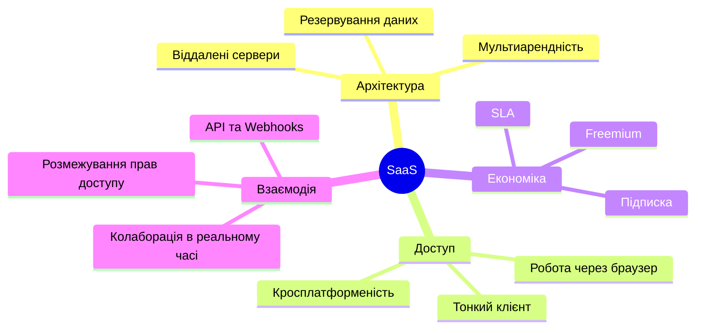

# Лабораторна робота №1

**Тема:** Дослідження хмарних сервісів моделі SaaS
**Виконав:** студент групи РПЗ-34 Козуб Макар
**Мета:** Ознайомитися з популярними хмарними сервісами моделі SaaS, дослідити їх та налаштувати для розв'язання прикладних завдань.
**Програмне забезпечення:** Веб-браузер Google Chrome, SaaS-сервіси (Google Workspace, Trello, Figma, Google Colab).

---

## 1. Завдання попередньої підготовки

### Словник термінів (SaaS Glossary)

- **SaaS (Software as a Service)** — програмне забезпечення як послуга: користувач працює з готовим додатком через браузер, нічого не встановлюючи й не адмініструючи сервери.
- **Multi-tenancy (мультиарендність)** — одна копія програми обслуговує багатьох клієнтів одночасно, а дані кожного ізольовані.
- **Subscription model (модель підписки)** — регулярна оплата (щомісяця або щороку) за доступ до сервісу замість разової купівлі ліцензії.
- **SLA (Service Level Agreement)** — угода між провайдером і клієнтом про гарантований рівень доступності сервісу (наприклад, 99.9% аптайму) та компенсації за збої.
- **On-demand self-service (самообслуговування на вимогу)** — користувач сам реєструється, обирає тариф і починає працювати без звернення до менеджерів.
- **Scalability (масштабованість)** — здатність системи витримувати зростання навантаження чи кількості користувачів за рахунок додаткових потужностей.
- **API integration (інтеграція через API)** — зв'язування сервісів між собою через відкриті інтерфейси (REST, Webhooks), наприклад, сповіщення з Trello у Slack.
- **Cloud storage (хмарне сховище)** — зберігання файлів на серверах провайдера з доступом і синхронізацією з будь-якого пристрою.
- **Data redundancy (резервування даних)** — копіювання даних між кількома серверами чи дата-центрами, щоб не втратити їх при аварії.
- **Thin client (тонкий клієнт)** — браузер або пристрій, який лише показує інтерфейс, а всі обчислення виконує сервер.

### Інтелект-карта (Mind Map)



### Відповіді на питання

#### Порівняння SaaS, PaaS та IaaS

- **IaaS** — оренда інфраструктури: віртуальні машини, диски, мережа. ОС і всі програми користувач встановлює сам (AWS EC2, DigitalOcean).
- **PaaS** — готове середовище для розробки й запуску додатків. Провайдер піклується про ОС і бази даних, розробник пише лише код (Heroku, Firebase, Vercel).
- **SaaS** — готовий додаток, який просто відкривають у браузері (Google Docs, Trello, Figma).

| Критерій | IaaS | PaaS | SaaS |
|---|---|---|---|
| Що надається | Віртуальні машини, диски, мережа | Середовище для коду та БД | Готовий застосунок |
| Для кого | DevOps, системні адміністратори | Програмісти | Кінцеві користувачі, команди |
| Що контролює користувач | ОС, мережа, програми, дані | Код і налаштування додатку | Лише свої дані та акаунт |
| Приклади | AWS EC2, Google Compute Engine | Heroku, Render, Vercel | Notion, Google Sheets, Trello |

#### 5 популярних SaaS-сервісів для ІТ-спеціаліста

| Сервіс | Функціонал | Переваги |
|---|---|---|
| **GitHub** | Хостинг Git-репозиторіїв, Pull Requests, Issues, CI/CD через GitHub Actions | Контроль версій в одному місці, автоматичні збірки й тести без власних серверів |
| **Postman** | Тестування, мокування та документування REST і GraphQL API | Спільні колекції запитів та оточення для всієї команди |
| **Trello** | Kanban-дошки, картки завдань, дедлайни, виконавці | Простий інтерфейс, вбудована автоматизація |
| **Figma** | Проєктування інтерфейсів і прототипів у браузері | Спільна робота в реальному часі, Dev Mode для розробників |
| **Slack** | Корпоративний чат з каналами, тредами, дзвінками та ботами | Миттєві сповіщення з GitHub, Jira та моніторингу |

#### Колаборація в реальному часі

**Колаборація в реальному часі** — це коли кілька людей одночасно працюють над одним документом, а зміни одразу з'являються в усіх на екрані без перезавантаження сторінки. Технічно це працює через WebSockets та алгоритми синхронізації (OT, CRDT), які не дають правкам конфліктувати.

Приклади в SaaS:

- **Google Docs / Sheets** — кілька людей пишуть документ або рахують бюджет, бачать курсори одне одного й лишають коментарі.
- **Figma** — дизайнер і розробник одночасно працюють в одному макеті.
- **Google Colab** — спільне редагування й перегляд коду та результатів його виконання.

---

## 2. Теоретичні завдання на дослідження

### 2.1 Офісні та продуктивні інструменти

| Сервіс | Особливості |
|---|---|
| **Google Workspace** | Docs, Sheets, Slides у браузері, найкраща спільна робота в реальному часі |
| **Microsoft 365** | Word, Excel, PowerPoint, Teams; є веб-версії та програми на ПК, працює за підпискою |
| **Zoho Docs** | Онлайн-офіс із сховищем, зручний у зв'язці з іншими сервісами Zoho, функцій менше, ніж у конкурентів |

**Чому SaaS:** додатки працюють у браузері, не потребують встановлення, а оновлення робить провайдер.
**Використання в ІТ:** технічні завдання, документація, звіти, протоколи мітингів, розрахунок кошторису.

### 2.2 Зберігання файлів і синхронізація

| Сервіс | Особливості |
|---|---|
| **Dropbox** | Базовий безкоштовний тариф невеликий, дуже швидка синхронізація |
| **pCloud** | Є безкоштовний тариф, можна купити «довічний» план одноразовою оплатою |
| **Mega** | Наскрізне шифрування (end-to-end), великий безкоштовний обсяг |

**Чому SaaS:** готове сховище без власних серверів, доступне з будь-якого пристрою.
**Використання в ІТ:** бекапи, дампи баз даних, логи, збірки проєктів, обмін великими файлами.

### 2.3 Спільна робота та управління проєктами

| Сервіс | Особливості |
|---|---|
| **Trello** | Kanban-дошки, дуже простий, підходить для малих проєктів |
| **Asana** | Списки, таймлайн, залежності між задачами, потужніший за Trello |
| **Notion** | Поєднує нотатки, бази даних і вікі в одному просторі |

**Чому SaaS:** платформи повністю обслуговує провайдер, працюють з будь-якого пристрою.
**Використання в ІТ:** спринти (Scrum, Kanban), розподіл задач, контроль термінів, база знань команди.

### 2.4 Комунікація та відеоконференції

| Сервіс | Особливості |
|---|---|
| **Zoom** | Відеодзвінки, демонстрація екрана, запис зустрічей |
| **Google Meet** | Працює прямо в браузері, інтегрований із Google-акаунтом і Календарем |
| **Slack** | Чат із каналами та інтеграціями; безкоштовний план має обмеження по історії |

**Чому SaaS:** обробка аудіо/відео й зберігання листування відбуваються на серверах провайдера.
**Використання в ІТ:** daily stand-up, планування спринтів, співбесіди, демонстрація екрана, сповіщення від систем моніторингу.

### 2.5 Графічний дизайн і редагування медіа

| Сервіс | Особливості |
|---|---|
| **Canva** | Готові шаблони для презентацій, постерів, соцмереж |
| **Pixlr** | Онлайн-редактор фото, схожий на Photoshop |
| **Figma** | Проєктування інтерфейсів і прототипів, спільна робота |

**Чому SaaS:** редагування відбувається в браузері, потужна відеокарта не потрібна.
**Використання в ІТ:** макети інтерфейсів, дизайн-системи, прототипи, графіка для сайтів і презентацій.

### 2.6 Хмарні середовища розробки (IDE)

| Сервіс | Особливості |
|---|---|
| **Replit** | Онлайн-IDE з багатьма мовами, терміналом і хостингом |
| **Google Colab** | Jupyter-блокноти для Python, безкоштовні GPU/TPU |
| **GitHub Codespaces** | VS Code у браузері, прив'язаний до репозиторію GitHub |

**Чому SaaS:** готове середовище з компілятором і терміналом, не треба нічого налаштовувати локально.
**Використання в ІТ:** швидкі прототипи, навчання моделей (Colab), спільне налагодження, старт роботи з репозиторієм одним кліком.

---

## 3. Практична частина: «Управління проєктами в хмарі»

### Опис проєкту

**Назва:** DevDesk — хмарна платформа для служби технічної підтримки та управління ІТ-інцидентами.
**Мета:** приймати звернення користувачів, розподіляти їх між лініями підтримки, стежити за дедлайнами згідно з SLA та надсилати сповіщення.

### План завдань за етапами

**Етап 1. Аналіз вимог**

1. Зібрати бізнес-вимоги та правила SLA.
2. Скласти специфікацію функціональних вимог і описати ролі (клієнт, оператор, інженер).
3. Побудувати діаграму прецедентів (створення, ескалація, закриття звернення).
4. Спроєктувати REST API.
5. Оцінити терміни, трудомісткість і ризики.

**Етап 2. Дизайн UI/UX**

1. Описати User Flow для оператора та клієнта.
2. Намалювати wireframes дашборду інцидентів.
3. Створити UI-Kit (кнопки, поля, бейджі пріоритетів).
4. Зробити макети форми тікета та історії переписки.
5. Перевірити зручність інтерфейсу й підготувати макет для верстки.

**Етап 3. Backend-розробка**

1. Спроєктувати схему БД (users, tickets, comments, categories, sla_rules).
2. Реалізувати автентифікацію через JWT.
3. Розробити CRUD API для тікетів (створення, фільтри, зміна статусів).
4. Зробити фоновий сервіс контролю дедлайнів SLA та ескалації.
5. Підключити сповіщення через Email і Telegram.

**Етап 4. Тестування**

1. Написати unit-тести для розрахунку часу реагування за SLA.
2. Скласти тест-план і чек-листи для перевірки форм.
3. Протестувати ендпоінти API в Postman.
4. Перевірити безпеку та обробку помилок.
5. Провести регресійне тестування перед деплоєм.

**Етап 5. Деплой**

1. Запакувати бекенд і БД у Docker (docker-compose).
2. Налаштувати CI/CD у GitHub Actions.
3. Розгорнути PostgreSQL на хмарному сервері.
4. Налаштувати Nginx і SSL-сертифікат.
5. Підключити моніторинг і збір логів.

### Посилання на хмарні ресурси

**3. Спільна папка на Google Диску («DevDesk Project»):**
https://drive.google.com/drive/folders/1XhoVjcjgp0m8HOlyq5FGfvSVpxbq5TmE?usp=sharing

**4. Спільний документ у Google Docs** (використано розумні чипи, спадні списки та контрольні списки):
https://docs.google.com/document/d/1v1aawBazAZ57hu7JyfZ4-H7pH-ykmrf1zrO_8-A2zVg/edit?tab=t.nibsauhgikkr#heading=h.iohnkzxfae4t

**5. Google Таблиця контролю проєкту** (завдання, години, ставка, вартість за формулою «години × ставка», загальний бюджет через SUM):
https://docs.google.com/spreadsheets/d/1FuAF4GqYcMMUUkZvvZ5GsVkHzSHiFFsTK1oPmv1JWXY/edit?gid=527205950#gid=527205950

**6. Дошка в Trello** (картки етапів, дедлайни, виконавці, автоматичні нагадування):
https://trello.com/invite/b/6abd58c33e35132117e10da0/ATTIe5fa300d6f30a8dc28125dcc1cbd00b0308ADDD5/devdesk

**7. Макет у Figma** (прототип робочого місця оператора підтримки, доступ на редагування надано):
https://www.figma.com/design/2Wkh6S8MdJAzatvLX3OpI2/DevDesk--%D1%80%D0%BE%D0%B1%D0%BE%D1%87%D0%B5-%D0%BC%D1%96%D1%81%D1%86%D0%B5-%D0%BE%D0%BF%D0%B5%D1%80%D0%B0%D1%82%D0%BE%D1%80%D0%B0?node-id=0-1&t=6paLmgP4kDyaYqmp-1

**8. Код у Google Colab** (виводить склад команди проєкту):
https://colab.research.google.com/drive/1M32FnXeFO-LjkaE2UEA725cGsPL3bgdW?usp=sharing

```python
team_members = {
    "Project Lead / Backend Developer": "Козуб Макар",
}

print("=" * 55)
print("  Склад команди проєкту DevDesk SaaS")
print("=" * 55)
for role, name in team_members.items():
    print(f"Посада: {role:<35} | Спеціаліст: {name}")
print("=" * 55)
```

**9. Презентація проєкту (Google Презентації):**
https://docs.google.com/presentation/d/13SVInZeJLJ5fVGWTk74Cserc50dI9Ug6igmK0I4vsi8/edit?usp=sharing

---

## 4. Контрольні питання

### 1. Порівняйте Dropbox, Google Drive та OneDrive. Які функції резервного копіювання та безпеки вони надають?

- **Google Drive** тісно інтегрований із Google Docs, тому файли можна редагувати просто в браузері.
- **OneDrive** найкраще працює з Windows і Microsoft 365, має «Personal Vault» із додатковою перевіркою особи.
- **Dropbox** передає при синхронізації лише змінені частини файлу (block-level sync), що економить трафік.

Спільне: усі три шифрують трафік (TLS) і дані на серверах (AES-256), підтримують двофакторну автентифікацію, автоматичне копіювання вибраних папок ПК і зберігають історію версій файлів (зазвичай 30 днів).

### 2. Trello та Asana: спільні та відмінні риси

**Спільне:** обидва є SaaS, працюють із Kanban-дошками та картками, дозволяють призначати виконавців, ставити дедлайни, додавати файли та підключати хмарні диски.

**Відмінне:** Trello простіший і швидкий на старті, підходить для малих проєктів. Asana потужніша: має залежності між задачами, діаграму Ганта (Timeline), аналіз завантаженості команди та підтримку кількох пов'язаних проєктів.

### 3. Google Apps Script

**Google Apps Script** — хмарна скриптова платформа на JavaScript, яка автоматизує роботу з Google Docs, Sheets, Gmail та іншими сервісами Google.

Приклади:

- автоматично надсилати лист через Gmail, коли в таблиці рядок отримує статус «Готово»;
- створювати PDF-акти з шаблону в Google Docs на основі даних таблиці;
- щопонеділка автоматично архівувати старі рядки таблиці (тригер за часом).

### 4. Google Colab та Replit

**Google Colab** орієнтований на Python, Data Science та машинне навчання. Працює як Jupyter Notebook і дає безкоштовний доступ до GPU та TPU.

**Replit** — повноцінна онлайн-IDE з десятками мов, файловою структурою, терміналом і можливістю хостити вебсервери.

**Коли що обирати:** Colab — для роботи з даними, навчання нейромереж і розрахунків. Replit — для швидкої розробки вебдодатків, ботів і скриптів та для парного програмування.

### 5. Чи є онлайн-конструктори сайтів SaaS?

Так. Конструктори сайтів (Wix, Webflow, Shopify) є SaaS: користувач працює в браузері й платить за підпискою. Орендувати сервери, налаштовувати Apache чи Nginx, підключати бази даних і оновлювати сертифікати безпеки не потрібно, усе це робить провайдер.

---

## 5. Висновки

Під час лабораторної роботи я ознайомився з моделлю SaaS, порівняв її з IaaS і PaaS та розглянув популярні сервіси для розробки, комунікації та управління проєктами.

На прикладі проєкту DevDesk я попрацював із основними SaaS-інструментами: створив спільну папку в Google Диску, документ у Google Docs, таблицю з бюджетом у Google Sheets, дошку в Trello, макет у Figma та скрипт у Google Colab, а також підготував презентацію.

Робота показала, що SaaS спрощує командну роботу, дозволяє працювати в реальному часі з будь-якого пристрою та зменшує витрати на власну інфраструктуру.
