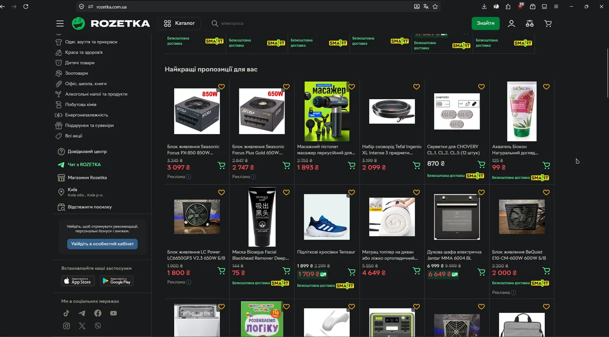
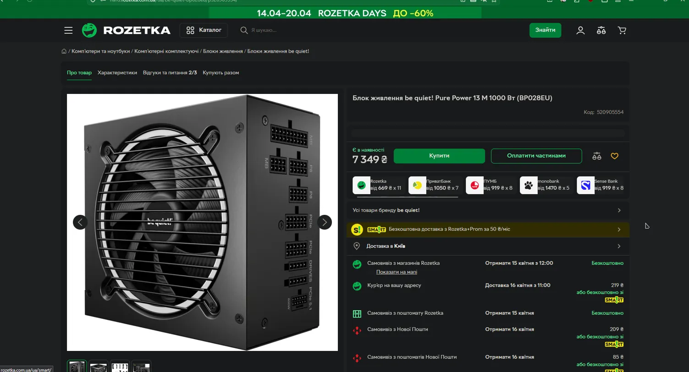
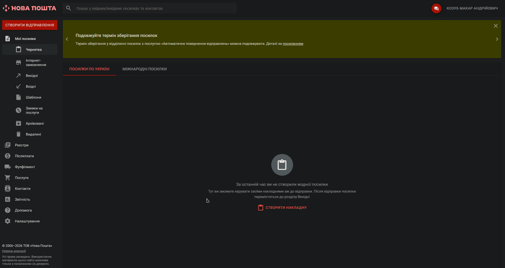
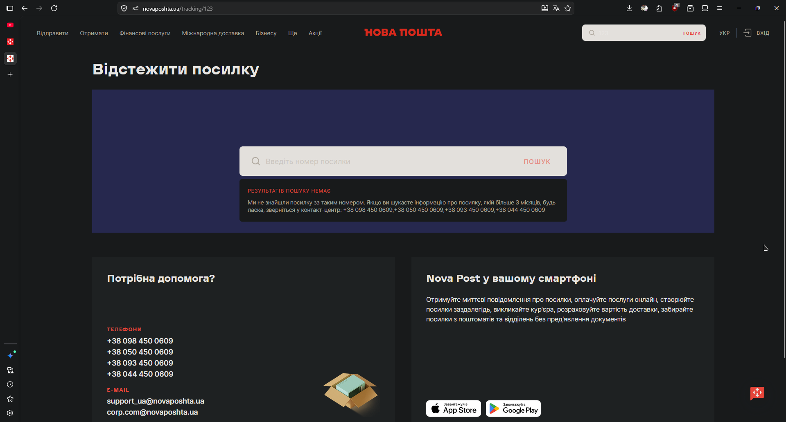

# СРС_Лекція №7 Козуб Макар РПЗ-33

---

## Завдання 1 — Три принципи гештальту, які зустрічаються найчастіше

Гештальт — це набір психологічних принципів, що пояснюють, як мозок автоматично групує і «добудовує» візуальні елементи. У дизайні їх використовують, щоб зменшити когнітивне навантаження і зробити інтерфейс зрозумілим без зайвих пояснень.

Я виділив три принципи, які зустрічаються буквально в кожному другому інтерфейсі.

---

### 1. Принцип близькості (Proximity)

**Суть:** Елементи, розташовані близько один до одного, сприймаються як єдина група — навіть без рамок і розділювачів.

**Де зустрічається:**

- **Google Search** — заголовок + URL + опис результату стоять близько і сприймаються як одна «картка», хоча між ними немає жодної рамки
- **Мобільні меню** — іконка і підпис під нею стоять поруч, тому мозок зчитує їх як одну кнопку
- **Форми реєстрації** — поля «Email» і «Пароль» згруповані разом, що одразу дає зрозуміти: це один логічний блок

**Чому це важливо:** Близькість — найдешевший спосіб дати структуру сторінці без жодної лінії чи рамки. Користувач не аналізує — він просто відчуває, що ці елементи пов'язані.

---

### 2. Принцип схожості (Similarity)

**Суть:** Елементи однакового вигляду (колір, форма, розмір) сприймаються як такі, що належать до однієї категорії або виконують однакову функцію.

**Де зустрічається:**

- **CTA-кнопки** — всі основні кнопки на сайті одного кольору. Відразу ясно, що саме треба натиснути
- **Навігаційні меню** — однаковий шрифт і розмір у всіх пунктах дає зрозуміти, що це однорідний список
- **Картки товарів на маркетплейсах** — однакова структура картки (фото, назва, ціна, кнопка) сигналізує: «це все об'єкти одного типу»

**Чому це важливо:** Схожість створює «мову інтерфейсу». Якщо всі посилання синього кольору — я не думаю, а просто тисну. Варто порушити цей принцип — і одразу з'являється плутанина.

---

### 3. Принцип фігури і фону (Figure/Ground)

**Суть:** Мозок автоматично відділяє «головне» (фігуру) від «другорядного» (фону). Дизайнер може керувати цим, щоб акцентувати увагу на потрібному елементі.

**Де зустрічається:**

- **Модальні вікна** — затемнений фон і яскраве вікно поверх. Мозок миттєво розуміє, де треба взаємодіяти
- **Картки з тінню** — легка тінь «піднімає» картку над фоном, сигналізуючи: «я окремий об'єкт»
- **Hero-секції лендінгів** — розмитий або однотонний фон і чіткий текст/зображення спереду

**Чому це важливо:** Без чіткого розмежування фігури і фону все зливається. Цей принцип буквально «говорить» очам, куди дивитися спочатку.

---

## Завдання 2 — Принципи гештальту на прикладі Rozetka

**Сервіс:** Rozetka — https://rozetka.com.ua

Rozetka — один із найбільших українських маркетплейсів. Обрав його, бо інтерфейс складний: багато елементів на одній сторінці, але при цьому він залишається зрозумілим. Це хороший привід подивитися, як саме там працюють гештальт-принципи.

---

### Скріншот 1 — Шапка сайту

**Принцип схожості:**
Іконки у правій частині шапки (профіль, порівняння, кошик) виконані в одному лінійному стилі, однакового розміру і кольору. Мозок одразу зчитує їх як групу «системних дій» — не потрібно читати підписи, щоб зрозуміти, що це.

**Принцип близькості:**
Поле пошуку і кнопка «Знайти» стоять впритул і сприймаються як єдиний інструмент. Логотип і бургер-меню зліва також згруповані разом — утворюють зону «навігації», відокремлену від зони «пошуку».

**Принцип фігури і фону:**
Кнопка «Знайти» — зелена на темному фоні шапки. Вона єдина кольорова у шапці, тому одразу виділяється як головна інтерактивна дія. Решта елементів — нейтральні, відходять на другий план.

---

### Скріншот 2 — Каталог товарів

**Принцип схожості:**
Кожна картка товару має абсолютно однакову структуру: фото → назва → стара ціна → актуальна ціна → кнопка кошика. Ця повторюваність — не випадковість: я одразу знаю, де шукати ціну, не «читаючи» кожну картку заново.

**Принцип близькості:**
Назва товару, ціни і кнопка кошика згруповані в нижній частині кожної картки і відокремлені від фото. Значок «Безкоштовна доставка SMART» стоїть впритул до ціни — мозок сприймає це як частину інформації про вартість, а не як окремий банер.

**Принцип фігури і фону:**
Картки товарів розташовані на темному фоні сторінки. Самі картки темніші за звичні білі маркетплейси, але все одно трохи відрізняються від фону — достатньо, щоб сприйматися як окремі об'єкти, а не суцільна стіна контенту.

---

### Скріншот 3 — Сторінка товару

**Принцип близькості:**
Ціна, кнопка «Купити» і «Оплатити частинами» згруповані в одному блоці — це зона прийняття рішення про покупку. Варіанти доставки розташовані нижче окремою групою. Між цими двома зонами є чіткий відступ, хоча жодної лінії чи рамки немає — близькість всередині групи і відстань між групами роблять структуру зрозумілою.

**Принцип схожості:**
Всі варіанти доставки (самовивіз з магазину, кур'єр, самовивіз з пошти тощо) оформлені однаково: іконка + назва + дата + вартість. Мозок зчитує їх як однорідний список, а не намагається розібрати кожен рядок окремо.

**Принцип фігури і фону:**
Зелений банер «ROZETKA DAYS» у самому верху сторінки — яскравий, контрастний, виділяється на темному фоні. Це свідома маніпуляція принципом фігури/фону: банер акції має «вистрибувати» і привертати увагу до знижки ще до того, як користувач починає читати сторінку.

---

## Завдання 3 — Три закони UX, які зустрічаються найчастіше

Закони UX — це узагальнені спостереження про поведінку людей при взаємодії з інтерфейсами. Більшість звучать як здоровий глузд, але їх легко порушити, якщо не думати про них свідомо.

---

### 1. Закон Хіка (Hick's Law)

**Суть:** Чим більше варіантів вибору — тим більше часу потребує людина для прийняття рішення. Складність зростає логарифмічно.

**Де зустрічається:**

- **Онбординг Notion** — при першому запуску пропонується лише 3-4 шаблони, а не всі сотні. Це знижує «параліч вибору»
- **Мобільні меню** — замість 15 пунктів залишають 4-5 основних, решта ховається в «Ще»
- **Amazon One-Click** — покупка в один клік є прямим наслідком цього закону: мінімум кроків — максимум конверсії

**Чому це важливо:** Сайти з меню на 20+ пунктів часто просто закривають. Мозок або тікає від великого вибору, або вибирає наосліп. Дизайнер мусить «редагувати» варіанти за користувача.

---

### 2. Закон Фіттса (Fitts's Law)

**Суть:** Час досягнення цільового елемента залежить від відстані до нього і його розміру. Чим більша ціль і чим вона ближча — тим швидше до неї дістатися.

**Де зустрічається:**

- **Велика кнопка «Купити» на мобільних сайтах** — займає майже всю ширину екрану, щоб не промахнутися пальцем
- **Кути екрану в macOS** — кут екрану «нескінченно великий», бо мишка впирається в нього автоматично. Саме тому головне меню Apple — у лівому верхньому куті
- **FAB-кнопка в Material Design** — велика, кругла, у нижньому правому куті — зона великого пальця при триманні телефону

**Чому це важливо:** Розмір кнопки — це не лише естетика. Маленька кнопка «Купити» — прямий збиток конверсії. Цей закон особливо критичний для мобільного дизайну.

---

### 3. Закон Міллера (Miller's Law)

**Суть:** Людина може утримувати в короткочасній пам'яті приблизно 7 ± 2 об'єкти одночасно.

**Де зустрічається:**

- **Навігаційні меню** — рідко хто робить більше 7 пунктів у головному меню, і це не випадковість
- **Пагінація** — замість 1000 результатів одразу, їх розбивають на сторінки
- **Телефонні номери** — записуються групами (099) 123-45-67, а не суцільним рядком 0991234567

**Чому це важливо:** Якщо на сторінці більше 7 паралельних варіантів чи секцій — мозок перестає їх розрізняти і просто «відключається». Дизайнер мусить групувати і обмежувати кількість одночасно видимих сутностей.

---

## Завдання 4 — Закони UX на прикладі Нової Пошти

**Сервіс:** Нова Пошта — https://novaposhta.ua

Для цього завдання я обрав Нову Пошту — сервіс з чітко вираженими основними сценаріями (відстежити, відправити), що дозволяє наочно простежити як закони UX виконуються або порушуються.

---

### Скріншот 1 — Головна сторінка

**Закон Хіка — застосовано добре:**
У шапці лише 6 пунктів меню. На самій сторінці — три чітких дії: «Детальніше», «Відстежити», «Створити відправлення». Не 20 функцій одразу — три сценарії, і користувач одразу розуміє, що йому робити.

**Закон Фіттса — застосовано:**
Кнопка «Відстежити» — найбільша і найяскравіша на сторінці: червона, широка, з великим текстом. Вона є головною дією, тому отримала найбільший розмір і найвищий контраст. Поле введення поруч — широке, легко потрапити.

---

### Скріншот 2 — Сторінка відстеження

**Закон Міллера — застосовано:**
На сторінці рівно одна дія — ввести номер посилки. Жодних зайвих елементів у зоні уваги. Решта інформації (допомога, додаток) подається нижче, тільки після основного сценарію — це патерн «прогресивного розкриття», прямо пов'язаний з обмеженнями короткочасної пам'яті.

**Закон Фіттса — застосовано:**
Поле пошуку займає більшу частину ширини синього блоку. Кнопка «Пошук» вбудована прямо в поле праворуч — відстань між введенням і підтвердженням мінімальна.

**Закон Хіка — є питання:**
Повідомлення про помилку містить одразу чотири телефонні номери підряд без жодної ієрархії. Якби один номер був виділений як основний, а решта — як альтернативи, рішення про дзвінок прийнялося б швидше.

---

### Скріншот 3 — Особистий кабінет

**Закон Міллера — частково дотриманий:**
Пункти меню згруповані за розділами («Мої посилки», «Реєстри», «Фінанси» тощо), а не висипані одним списком. Але підпунктів у розділі «Мої посилки» — сім штук, і деякі з них («Архівовані», «Видалені») виглядають зайвими для більшості звичайних користувачів.

**Закон Хіка — є де покращити:**
Загальна кількість пунктів меню в кабінеті — близько 15. Для нового користувача це перевантажено. «Реєстри», «Післяплати», «Фулфілмент» — для звичайного користувача виглядають однаково незрозуміло, ієрархія між ними недостатньо чітка.

---

## Висновок

Гештальт-принципи і закони UX — це взаємопов'язана система. Принцип близькості говорить мозку, що є група. Закон Міллера говорить дизайнеру, що груп не може бути нескінченно. Закон Фіттса каже, що до важливих елементів треба дотягуватися легко. А принцип фігури і фону визначає, на що дивитися спочатку. Rozetka і Нова Пошта — два різні за характером сервіси, але обидва свідомо використовують ці принципи. Там де вони дотримані — інтерфейс працює непомітно. Там де порушені (як чотири номери телефону підряд або перевантажене меню кабінету) — одразу відчувається дискомфорт.

---